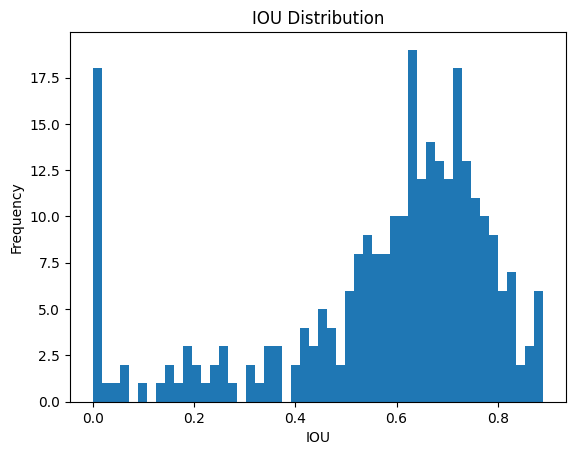
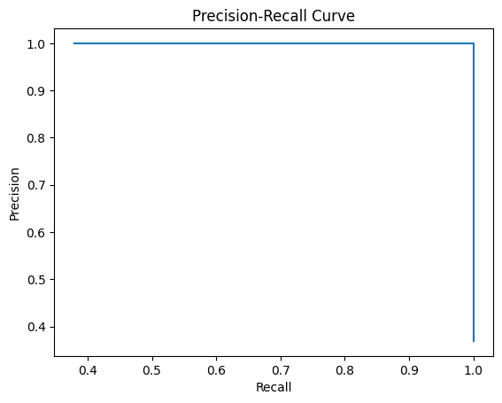

# Plate Vision

Plate Vision detects a vehicle's license plate, extracts its text, and returns an annotated image through a browser interface. It was developed for **[COMP4102 — Computer Vision](https://calendar.carleton.ca/calendars/2023-2024/undergrad/courses/COMP/)** at Carleton University.

The project combines transfer learning for plate localization, OpenCV image processing, EasyOCR text recognition, and a FastAPI web application.

## How it works

1. The user uploads a vehicle image through the web interface.
2. The image is resized to `224 × 224` and normalized.
3. An InceptionResNetV2-based regression model predicts a normalized license-plate bounding box.
4. The predicted box is mapped back to the original image dimensions.
5. OpenCV crops, converts, and thresholds the plate region.
6. EasyOCR extracts the most confident text prediction.
7. The application returns the original image and an annotated result containing the bounding box, recognized text, and OCR confidence.

Uploaded images are processed in memory and are not intentionally persisted by the application.

## Model and data

The detector uses an ImageNet-pretrained InceptionResNetV2 backbone with a regression head that predicts the plate's normalized centre coordinates, width, and height. The training script uses mean squared error, Adam, 180 epochs, and a batch size of 16.

The repository contains:

- 2,993 labeled development images
- 372 labeled test images
- YOLO-style normalized bounding-box annotations
- Training loss and accuracy curves
- IoU distribution and precision-recall plots

The last committed notebook execution reports a **mean intersection over union (IoU) of 0.573** on the held-out data.





## Repository structure

```text
app/
├── main.py                         FastAPI entry point
├── scripts/
│   └── detect_licenseplate.py      Detection, OCR, and annotation pipeline
├── static/style.css                Web interface styling
└── templates/index.html            Upload and results interface
data/
├── imgs/                            Development images
├── labels/                          Development annotations
└── test/                            Held-out images and annotations
results/                             Training and evaluation plots
plate-vision.ipynb                  Processing, evaluation, and demo workflow
training.py                         GPU-oriented model training script
history.txt                         Saved training history
requirements.txt                    Original project environment snapshot
```

## Running the web application

### 1. Create an environment

TensorFlow 2.9.1 requires an older Python release; Python 3.9 or 3.10 is recommended.

```bash
git clone https://github.com/Gabmelom/plate-vision.git
cd plate-vision
python -m venv .venv
```

Activate it on Windows:

```powershell
.\.venv\Scripts\Activate.ps1
```

Or on macOS/Linux:

```bash
source .venv/bin/activate
```

### 2. Install runtime dependencies

`requirements.txt` is a snapshot of the original Ubuntu/CUDA environment and contains platform-specific packages. For the web application, begin with the smaller runtime set:

```bash
python -m pip install "tensorflow==2.9.1" easyocr opencv-python pillow numpy fastapi uvicorn jinja2 python-multipart
```

EasyOCR depends on PyTorch. If its automatic installation fails, install the appropriate build using the [PyTorch installation selector](https://pytorch.org/get-started/locally/) and rerun the command above.

### 3. Download the trained detector

The trained model is not stored in Git because of its size. Download the [original project model](https://cmailcarletonca-my.sharepoint.com/:u:/g/personal/gabrielmelomartins_cmail_carleton_ca/EQOqvuylHr5PrvktS3n37KQBdzGV6u-D5g7-3iLPkO9egw?e=cmzi8x) and place it at:

```text
app/scripts/plate_detection_model.h5
```

The download is hosted externally and may require permission from the repository owner.

### 4. Start the server

Run the application from the `app` directory so its relative template and model paths resolve correctly:

```bash
cd app
python main.py
```

Open [http://127.0.0.1:8000](http://127.0.0.1:8000), select an image, and submit it for detection.

## Training and evaluation

`plate-vision.ipynb` documents data conversion, sample predictions, IoU evaluation, training-history visualization, and the intended front-end workflow. Its committed outputs can be reviewed without rerunning the notebook.

`training.py` is the standalone GPU training entry point. It expects preprocessed arrays in `data.npz`, builds the InceptionResNetV2 detector, and writes a Keras model after training. Reproducing training requires substantial compute and may require regenerating intermediate data that is not committed.

## Limitations

- Detection quality depends on plate size, viewing angle, lighting, obstruction, and image resolution.
- OCR is configured for English characters and may struggle with stylized, damaged, or low-contrast plates.
- The application loads the TensorFlow model and EasyOCR reader per request, prioritizing simplicity over production performance.
- This is an educational prototype and should not be used for surveillance, identification, or other high-stakes decisions.
